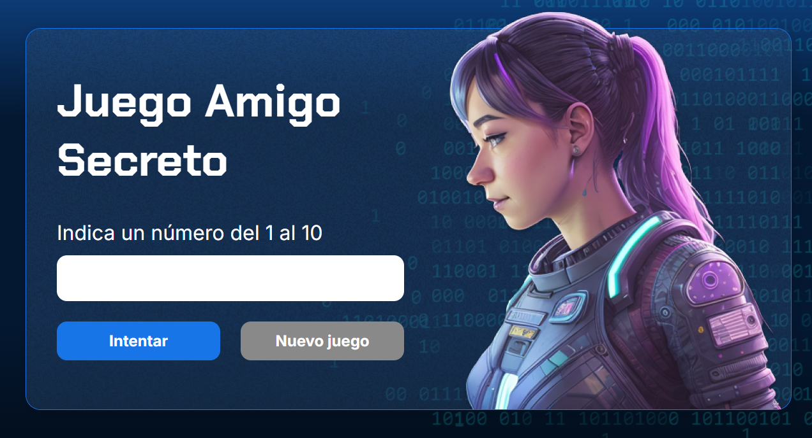

# 🔢 Juego del Número Secreto  

 <!-- Cambia la ruta a tu imagen de portada -->

---

## Insignias


---

## 📑 Índice
- [Descripción del Proyecto](#-descripción-del-proyecto)
- [Estado del Proyecto](#-estado-del-proyecto)
- [Demostración de Funciones](#-demostración-de-funciones)
- [Acceso al Proyecto](#-acceso-al-proyecto)
- [Tecnologías Utilizadas](#️-tecnologías-utilizadas)
- [Personas Contribuyentes](#-personas-contribuyentes)
- [Personas Desarrolladoras](#-personas-desarrolladoras)
- [Licencia](#-licencia)

---

## Descripción del Proyecto
El **Juego del Número Secreto** es una aplicación interactiva desarrollada en **JavaScript** que reta al usuario a adivinar un número secreto generado aleatoriamente dentro de un rango predefinido.  
El usuario cuenta con un número limitado de intentos para acertar.  
El sistema da pistas en cada intento, indicando si el número secreto es **mayor** o **menor** que el ingresado.  

---

## Estado del Proyecto
✅ Proyecto funcional.  
🔄 Se pueden agregar futuras mejoras como:  
- Personalizar el rango de números.  
- Cambiar la cantidad de intentos disponibles.  
- Interfaz gráfica más atractiva.  

---

## Demostración de Funciones
### Características principales:
- Generación de un **número secreto aleatorio** que no se repite hasta agotar el rango.  
- Validación de intentos del usuario.  
- Mensajes dinámicos para guiar al jugador.  
- Botón de **reinicio de juego** que restablece condiciones iniciales.  


## 📂 Acceso al Proyecto
1. Clonar el repositorio:  
   ```bash
   git clone https://github.com/tuusuario/numero-secreto.git
2. Abrir el archivo index.html en el navegador.

O también puden acceder a el directamente desde el siguiente enlace.

```bash
https://maurg15.github.io/Juego-Numero-Secreto/
